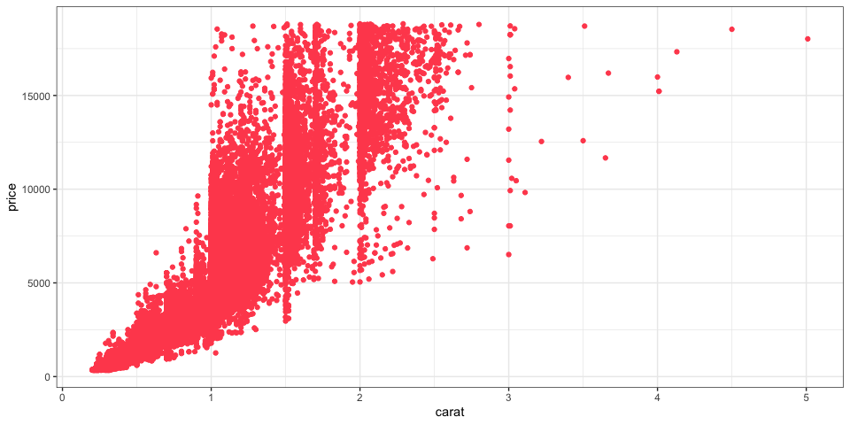

Linear Regression
================
Clare Gibson
10 March 2025

- [Introduction](#introduction)
  - [Packages](#packages)
  - [Data](#data)
- [Exploratory analysis](#exploratory-analysis)
  - [Check for missing data](#check-for-missing-data)
  - [Plot relationships](#plot-relationships)
  - [Set train and test data](#set-train-and-test-data)
- [Univariate linear regression](#univariate-linear-regression)
  - [Steps for regression](#steps-for-regression)
  - [Create `x_train` and `y_train`](#create-x_train-and-y_train)
  - [Visualise the data](#visualise-the-data)
  - [Compute cost](#compute-cost)

# Introduction

In this notebook, I work through the steps of linear regression as
taught in the [Machine Learning
Specialization](https://www.coursera.org/specializations/machine-learning-introduction)
available through [Coursera](https://coursera.org).

## Packages

I aim to write out most of the functions and calculations needed for
linear regression using base or tidyverse-flavoured R, and not by using
the specific machine learning packages that are available. However, I
will make use of a number of R packages for data wrangling and plotting.
These are all contained within the `tidyverse` wrapper. I also use a few
other helpful packages as listed in the code below.

``` r
# Load packages
library(tidyverse)
library(skimr)   # for viewing summary statistics
```

## Data

For this exercise I use the diamonds dataset that is provided with the
`ggplot2` package. This is a dataset containing the prices and other
attributes of over 50,000 round cut diamonds. Since I have already
loaded the `ggplot2` package (it is part of the `tidyverse` package), I
can access the diamonds dataset by simply calling `diamonds`.

``` r
diamonds
```

    ## # A tibble: 53,940 × 10
    ##    carat cut       color clarity depth table price     x     y     z
    ##    <dbl> <ord>     <ord> <ord>   <dbl> <dbl> <int> <dbl> <dbl> <dbl>
    ##  1  0.23 Ideal     E     SI2      61.5    55   326  3.95  3.98  2.43
    ##  2  0.21 Premium   E     SI1      59.8    61   326  3.89  3.84  2.31
    ##  3  0.23 Good      E     VS1      56.9    65   327  4.05  4.07  2.31
    ##  4  0.29 Premium   I     VS2      62.4    58   334  4.2   4.23  2.63
    ##  5  0.31 Good      J     SI2      63.3    58   335  4.34  4.35  2.75
    ##  6  0.24 Very Good J     VVS2     62.8    57   336  3.94  3.96  2.48
    ##  7  0.24 Very Good I     VVS1     62.3    57   336  3.95  3.98  2.47
    ##  8  0.26 Very Good H     SI1      61.9    55   337  4.07  4.11  2.53
    ##  9  0.22 Fair      E     VS2      65.1    61   337  3.87  3.78  2.49
    ## 10  0.23 Very Good H     VS1      59.4    61   338  4     4.05  2.39
    ## # ℹ 53,930 more rows

# Exploratory analysis

For this exercise, I will investigate whether I can predict the price of
a diamond using one or more features.

## Check for missing data

To start with, I will check if any of the observations have missing
values. If so, they will need to be removed.

``` r
sum(is.na(diamonds))
```

    ## [1] 0

This dataset has no missing values so no need to remove any rows.

## Plot relationships

Next, I will generate a series of plots to show the relationships
between the `price` variable and other variables in the dataset[^1].

``` r
# Plot the price variable against all other numerical variables
diamonds |> 
  pivot_longer(
    c(carat, depth, table, x, y, z),
    names_to = "var",
    values_to = "value"
  ) |> 
  ggplot(aes(x = value, y = price, color = cut)) +
    geom_point() +
    facet_wrap(~ var, scales = "free") +
    theme_bw()
```


From this plot, it appears that `price` has a positive linear
relationship with `carat`, `x`, `y` and `z`.

## Set train and test data

I will extract 80% of the dataset to use as training data and the
remaining 20% will be the test data. In order to do this, I need to
assign a unique ID to each row, then randomly select 80% of the rows
using the `slice()` function. Using the row IDs, I can then find the
remaining 20% to put into the test dataset.

``` r
# Add a unique ID to diamonds
df <- diamonds |> 
  rowid_to_column()

# Create training dataset
train <- df |> 
  slice_sample(prop = 0.8) |> 
  arrange(rowid)

# Create testing dataset
test <- df |> 
  filter(!rowid %in% train$rowid) |> 
  arrange(rowid)
```

# Univariate linear regression

Univariate linear regression uses a single feature $x$ to predict a
value $y$. In this example, I will try to predict the price of a diamond
from its carat value.

## Steps for regression

The model function for univariate linear regression is represented as:
$$
f_{w,b}(x)=wx+b
$$

where: - $x$ = carat - $y$ = price - $w,b$ = the parameters of the
linear regression model

To train the linear regression model I want to find the best $(w,b)$
parameters that fit my dataset. I can evaluate how well a choice of
$(w,b)$ fits the data by using the cost function $J(w,b)$.

To find the values $(w,b)$ that gets the smallest possible cost
$J(w,b)$, I will use a method called gradient descent.

## Create `x_train` and `y_train`

The code below loads the data into variables `x_train` and `y_train` and
displays summary statistics about each.

``` r
x_train <- train$carat
head(x_train)
```

    ## [1] 0.21 0.29 0.31 0.24 0.24 0.26

``` r
skim(x_train)
```

|                                                  |         |
|:-------------------------------------------------|:--------|
| Name                                             | x_train |
| Number of rows                                   | 43152   |
| Number of columns                                | 1       |
| \_\_\_\_\_\_\_\_\_\_\_\_\_\_\_\_\_\_\_\_\_\_\_   |         |
| Column type frequency:                           |         |
| numeric                                          | 1       |
| \_\_\_\_\_\_\_\_\_\_\_\_\_\_\_\_\_\_\_\_\_\_\_\_ |         |
| Group variables                                  | None    |

Data summary

**Variable type: numeric**

| skim_variable | n_missing | complete_rate | mean |   sd |  p0 | p25 | p50 |  p75 | p100 | hist  |
|:--------------|----------:|--------------:|-----:|-----:|----:|----:|----:|-----:|-----:|:------|
| data          |         0 |             1 |  0.8 | 0.48 | 0.2 | 0.4 | 0.7 | 1.04 | 5.01 | ▇▂▁▁▁ |

``` r
y_train <- train$price
head(y_train)
```

    ## [1] 326 334 335 336 336 337

``` r
skim(y_train)
```

|                                                  |         |
|:-------------------------------------------------|:--------|
| Name                                             | y_train |
| Number of rows                                   | 43152   |
| Number of columns                                | 1       |
| \_\_\_\_\_\_\_\_\_\_\_\_\_\_\_\_\_\_\_\_\_\_\_   |         |
| Column type frequency:                           |         |
| numeric                                          | 1       |
| \_\_\_\_\_\_\_\_\_\_\_\_\_\_\_\_\_\_\_\_\_\_\_\_ |         |
| Group variables                                  | None    |

Data summary

**Variable type: numeric**

| skim_variable | n_missing | complete_rate | mean | sd | p0 | p25 | p50 | p75 | p100 | hist |
|:---|---:|---:|---:|---:|---:|---:|---:|---:|---:|:---|
| data | 0 | 1 | 3932.98 | 4000.24 | 326 | 948 | 2396 | 5324 | 18823 | ▇▂▁▁▁ |

My dataset has data points.

## Visualise the data

Earlier I explored the relationships between price and all other
variables. Here I look at the relationship between the data points in my
training data only.

``` r
train |> 
  ggplot(aes(x = carat, y = price)) +
  geom_point(color = "#FF4F5C") +
  theme_bw()
```



From the chart I can see that as carat increase so does price. Neither
carat nor price ever go below 0.

## Compute cost

[^1]: Thanks to [this
    article](https://drsimonj.svbtle.com/plot-some-variables-against-many-others)
    for helping me to achieve this plot.
