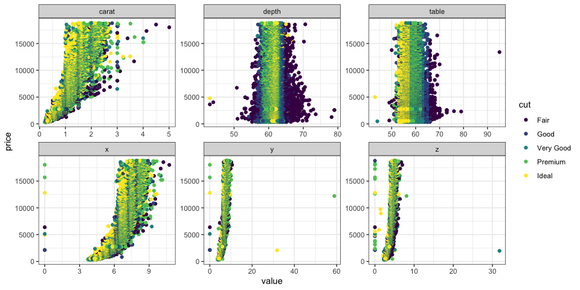

Linear Regression
================
Clare Gibson
10 March 2025

- [Introduction](#introduction)
  - [Packages](#packages)
  - [Data](#data)
- [Exploratory analysis](#exploratory-analysis)
  - [Train and test data](#train-and-test-data)
- [Univariate linear regression](#univariate-linear-regression)
  - [Variables and parameters](#variables-and-parameters)

# Introduction

In this notebook, I work through the steps of linear regression as
taught in the [Machine Learning
Specialization](https://www.coursera.org/specializations/machine-learning-introduction)
available through [Coursera](https://coursera.org).

## Packages

I aim to write out most of the functions and calculations needed for
linear regression using base or tidyverse-flavoured R, and not by using
the specific machine learning packages that are available. However, I
will make use of a number of R packages for data wrangling and plotting.
These are all contained within the `tidyverse` wrapper. I also use a few
other helpful packages as listed in the code below.

``` r
# Load packages
library(tidyverse)
library(here)
```

## Data

For this exercise I use the diamonds dataset that is provided with the
`ggplot2` package. This is a dataset containing the prices and other
attributes of over 50,000 round cut diamonds. Since I have already
loaded the `ggplot2` package (it is part of the `tidyverse` package), I
can access the diamonds dataset by simply calling `diamonds`.

``` r
diamonds
```

    ## # A tibble: 53,940 × 10
    ##    carat cut       color clarity depth table price     x     y     z
    ##    <dbl> <ord>     <ord> <ord>   <dbl> <dbl> <int> <dbl> <dbl> <dbl>
    ##  1  0.23 Ideal     E     SI2      61.5    55   326  3.95  3.98  2.43
    ##  2  0.21 Premium   E     SI1      59.8    61   326  3.89  3.84  2.31
    ##  3  0.23 Good      E     VS1      56.9    65   327  4.05  4.07  2.31
    ##  4  0.29 Premium   I     VS2      62.4    58   334  4.2   4.23  2.63
    ##  5  0.31 Good      J     SI2      63.3    58   335  4.34  4.35  2.75
    ##  6  0.24 Very Good J     VVS2     62.8    57   336  3.94  3.96  2.48
    ##  7  0.24 Very Good I     VVS1     62.3    57   336  3.95  3.98  2.47
    ##  8  0.26 Very Good H     SI1      61.9    55   337  4.07  4.11  2.53
    ##  9  0.22 Fair      E     VS2      65.1    61   337  3.87  3.78  2.49
    ## 10  0.23 Very Good H     VS1      59.4    61   338  4     4.05  2.39
    ## # ℹ 53,930 more rows

# Exploratory analysis

For this exercise, I will investigate whether I can predict the price of
a diamond using one or more features. To start with, I will check if any
of the observations have missing values. If so, they will need to be
removed.

``` r
sum(is.na(diamonds))
```

    ## [1] 0

This dataset has no missing values so no need to remove any rows. Next,
I will generate a series of plots to show the relationships between the
`price` variable and other variables in the dataset[^1].

``` r
# Plot the price variable against all other numerical variables
diamonds |> 
  pivot_longer(
    c(carat, depth, table, x, y, z),
    names_to = "var",
    values_to = "value"
  ) |> 
  ggplot(aes(x = value, y = price, color = cut)) +
    geom_point() +
    facet_wrap(~ var, scales = "free") +
    theme_bw()
```



From this plot, it appears that `price` has a positive linear
relationship with `carat`, `x`, `y` and `z`.

## Train and test data

I will extract 80% of the dataset to use as training data and the
remaining 20% will be the test data. In order to do this, I need to
assign a unique ID to each row, then randomly select 80% of the rows
using the `slice()` function. Using the row IDs, I can then find the
remaining 20% to put into the test dataset.

``` r
# Add a unique ID to diamonds
df <- diamonds |> 
  rowid_to_column()

# Create training dataset
train <- df |> 
  slice_sample(prop = 0.8) |> 
  arrange(rowid)

# Create testing dataset
test <- df |> 
  filter(!rowid %in% train$rowid) |> 
  arrange(rowid)
```

# Univariate linear regression

Univariate linear regression uses a single feature $x$ to predict a
value $y$. In this example, I will try to predict the price of a diamond
from its carat value.

## Variables and parameters

- $x$ = carat
- $y$ = price
- $w,b$ = the parameters of the linear regression model

The code below loads the data into variables `x_train` and `y_train`.

``` r
x_train <- train$carat
head(x_train)
```

    ## [1] 0.23 0.23 0.29 0.31 0.24 0.24

``` r
y_train <- train$price
head(y_train)
```

    ## [1] 326 327 334 335 336 336

[^1]: Thanks to [this
    article](https://drsimonj.svbtle.com/plot-some-variables-against-many-others)
    for helping me to achieve this plot.
