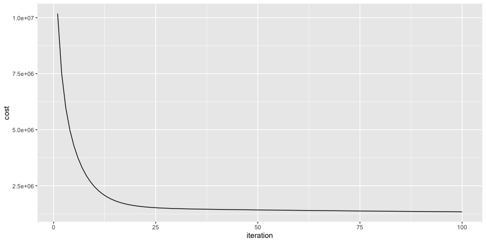

Linear Regression
================
Clare Gibson
27 March 2025

- [Introduction](#introduction)
  - [Packages](#packages)
  - [Data](#data)
- [Exploratory analysis](#exploratory-analysis)
  - [Check for missing data](#check-for-missing-data)
  - [Plot relationships](#plot-relationships)
  - [Set train and test data](#set-train-and-test-data)
- [Prepare data](#prepare-data)
  - [Steps for regression](#steps-for-regression)
  - [Create `x_train` and `y_train`](#create-x_train-and-y_train)
  - [Scale the `x_train` data](#scale-the-x_train-data)
- [Regression](#regression)
  - [Compute cost](#compute-cost)
  - [Compute gradient](#compute-gradient)
  - [Gradient descent](#gradient-descent)
- [Prediction](#prediction)

# Introduction

In this notebook, I work through the steps of linear regression as
taught in the [Machine Learning
Specialization](https://www.coursera.org/specializations/machine-learning-introduction)
available through [Coursera](https://coursera.org).

## Packages

I aim to write out most of the functions and calculations needed for
linear regression using base or tidyverse-flavoured R, and not by using
the specific machine learning packages that are available. However, I
will make use of a number of R packages for data wrangling and plotting.
These are all contained within the `tidyverse` wrapper. I also use a few
other helpful packages as listed in the code below.

``` r
# Load packages
library(tidyverse)
library(skimr)   # for viewing summary statistics
library(here)    # for file location

# Load custom functions
source(here("R/utils.R"))
```

## Data

For this exercise I use the diamonds dataset that is provided with the
`ggplot2` package. This is a dataset containing the prices and other
attributes of over 50,000 round cut diamonds. Since I have already
loaded the `ggplot2` package (it is part of the `tidyverse` package), I
can access the diamonds dataset by simply calling `diamonds`.

``` r
diamonds
```

    ## # A tibble: 53,940 × 10
    ##    carat cut       color clarity depth table price     x     y     z
    ##    <dbl> <ord>     <ord> <ord>   <dbl> <dbl> <int> <dbl> <dbl> <dbl>
    ##  1  0.23 Ideal     E     SI2      61.5    55   326  3.95  3.98  2.43
    ##  2  0.21 Premium   E     SI1      59.8    61   326  3.89  3.84  2.31
    ##  3  0.23 Good      E     VS1      56.9    65   327  4.05  4.07  2.31
    ##  4  0.29 Premium   I     VS2      62.4    58   334  4.2   4.23  2.63
    ##  5  0.31 Good      J     SI2      63.3    58   335  4.34  4.35  2.75
    ##  6  0.24 Very Good J     VVS2     62.8    57   336  3.94  3.96  2.48
    ##  7  0.24 Very Good I     VVS1     62.3    57   336  3.95  3.98  2.47
    ##  8  0.26 Very Good H     SI1      61.9    55   337  4.07  4.11  2.53
    ##  9  0.22 Fair      E     VS2      65.1    61   337  3.87  3.78  2.49
    ## 10  0.23 Very Good H     VS1      59.4    61   338  4     4.05  2.39
    ## # ℹ 53,930 more rows

# Exploratory analysis

For this exercise, I will investigate whether I can predict the price of
a diamond using several features.

## Check for missing data

To start with, I will check if any of the observations have missing
values. If so, they will need to be removed.

``` r
sum(is.na(diamonds))
```

    ## [1] 0

This dataset has no missing values so no need to remove any rows.

## Plot relationships

Next, I will generate a series of plots to show the relationships
between the `price` variable and other variables in the dataset[^1].

``` r
# Plot the price variable against all other numerical variables
diamonds |>
  pivot_longer(
    c(carat, depth, table, x, y, z),
    names_to = "var",
    values_to = "value"
  ) |>
  ggplot(aes(x = value, y = price, color = cut)) +
    geom_point() +
    facet_wrap(~ var, scales = "free") +
    theme_bw()
```


From this plot, it appears that `price` has a positive linear
relationship with `carat`, `x`, `y` and `z`.

## Set train and test data

I will extract 80% of the dataset to use as training data and the
remaining 20% will be the test data. In order to do this, I need to
assign a unique ID to each row, then randomly select 80% of the rows
using the `slice()` function. Using the row IDs, I can then find the
remaining 20% to put into the test dataset.

``` r
# Add a unique ID to diamonds
df <- diamonds |> 
  rowid_to_column()

# Create training dataset
train <- df |> 
  slice_sample(prop = 0.8) |> 
  arrange(rowid)

# Create testing dataset
test <- df |> 
  filter(!rowid %in% train$rowid) |> 
  arrange(rowid)
```

# Prepare data

Linear regression uses one or more features $\vec{x}$ to predict a value
$y$. In this example, I will try to predict the price of a diamond from
its features of `carat`, `x`, `y` and `z`.

## Steps for regression

The model function for linear regression is represented as:

$$
f_{\vec{w},b}(\vec{x})=\vec{w}\cdot\vec{x}+b
$$

where:

- $\vec{x}$ = \[carat, x, y, z\]
- $y$ = price
- $\vec{w},b$ = the parameters of the linear regression model

To train the linear regression model I want to find the best $\vec{w},b$
parameters that fit my dataset. I can evaluate how well a choice of
$\vec{w},b$ fits the data by using the cost function $J(\vec{w},b)$.

To find the values $\vec{w},b$ that gets the smallest possible cost
$J(\vec{w},b)$, I will use a method called gradient descent.

## Create `x_train` and `y_train`

The code below loads the data into variables `x_train` and `y_train` and
displays summary statistics about each.

``` r
x_train <- train |> 
  select(carat, x, y, z) |> 
  as.matrix()

head(x_train)
```

    ##      carat    x    y    z
    ## [1,]  0.21 3.89 3.84 2.31
    ## [2,]  0.31 4.34 4.35 2.75
    ## [3,]  0.24 3.94 3.96 2.48
    ## [4,]  0.24 3.95 3.98 2.47
    ## [5,]  0.22 3.87 3.78 2.49
    ## [6,]  0.23 4.00 4.05 2.39

``` r
skim(x_train)
```

|                                                  |         |
|:-------------------------------------------------|:--------|
| Name                                             | x_train |
| Number of rows                                   | 43152   |
| Number of columns                                | 4       |
| \_\_\_\_\_\_\_\_\_\_\_\_\_\_\_\_\_\_\_\_\_\_\_   |         |
| Column type frequency:                           |         |
| numeric                                          | 4       |
| \_\_\_\_\_\_\_\_\_\_\_\_\_\_\_\_\_\_\_\_\_\_\_\_ |         |
| Group variables                                  | None    |

Data summary

**Variable type: numeric**

| skim_variable | n_missing | complete_rate | mean |   sd |  p0 |  p25 |  p50 |  p75 |  p100 | hist  |
|:--------------|----------:|--------------:|-----:|-----:|----:|-----:|-----:|-----:|------:|:------|
| carat         |         0 |             1 | 0.80 | 0.48 | 0.2 | 0.40 | 0.70 | 1.04 |  5.01 | ▇▂▁▁▁ |
| x             |         0 |             1 | 5.74 | 1.12 | 0.0 | 4.72 | 5.70 | 6.54 | 10.74 | ▁▁▇▃▁ |
| y             |         0 |             1 | 5.74 | 1.12 | 0.0 | 4.73 | 5.71 | 6.54 | 10.54 | ▁▁▇▅▁ |
| z             |         0 |             1 | 3.54 | 0.71 | 0.0 | 2.91 | 3.53 | 4.04 | 31.80 | ▇▁▁▁▁ |

``` r
y_train <- train |> 
  select(price) |> 
  as.matrix()

head(y_train)
```

    ##      price
    ## [1,]   326
    ## [2,]   335
    ## [3,]   336
    ## [4,]   336
    ## [5,]   337
    ## [6,]   338

``` r
skim(y_train)
```

|                                                  |         |
|:-------------------------------------------------|:--------|
| Name                                             | y_train |
| Number of rows                                   | 43152   |
| Number of columns                                | 1       |
| \_\_\_\_\_\_\_\_\_\_\_\_\_\_\_\_\_\_\_\_\_\_\_   |         |
| Column type frequency:                           |         |
| numeric                                          | 1       |
| \_\_\_\_\_\_\_\_\_\_\_\_\_\_\_\_\_\_\_\_\_\_\_\_ |         |
| Group variables                                  | None    |

Data summary

**Variable type: numeric**

| skim_variable | n_missing | complete_rate | mean | sd | p0 | p25 | p50 | p75 | p100 | hist |
|:---|---:|---:|---:|---:|---:|---:|---:|---:|---:|:---|
| price | 0 | 1 | 3946.31 | 4003.14 | 326 | 954 | 2404 | 5354.25 | 18823 | ▇▂▁▁▁ |

My dataset has 43152 data points.

## Scale the `x_train` data

The features I am using for this regression exercise have different
ranges.

To optimize my linear regression function I will scale the features so
that they all fall within similar ranges.

``` r
# Zscore feature scaling
x_train_scaled <- scale(x_train)
```

# Regression

## Compute cost

In order to find the best values for $w$ and $b$ I need to try a lot of
different values and calculate the cost of each attempt. Then using
gradient descent I can obtain the optimal set of paramters to use in the
linear regression function.

The cost function is defined mathematically as:

$$J(w,b)=\frac{1}{2m}\sum_{i=1}^{m}{(f_{w,b}(x^{(i)})-y^{(i)})^{2}}$$

``` r
# Try some starting variables
initial_w <- 0.2
initial_b <- -0.5

cost <- compute_cost(x_train_scaled, y_train, initial_w, initial_b)
print(class(cost))
```

    ## [1] "numeric"

``` r
paste0("Cost at initial w,b: ", cost)
```

    ## [1] "Cost at initial w,b: 15798225.7135049"

## Compute gradient

The formulas to compute the gradients with respect to $w$ and $b$ are:
$$
\frac{\partial J(w,b)}{\partial b}  = \frac{1}{m} \sum\limits_{i = 0}^{m-1} (f_{w,b}(x^{(i)}) - y^{(i)})
$$

and

$$
\frac{\partial J(w,b)}{\partial w}  = \frac{1}{m} \sum\limits_{i = 0}^{m-1} (f_{w,b}(x^{(i)}) -y^{(i)})x^{(i)}
$$

## Gradient descent

In the next code cell I use the gradient descent function.

``` r
# initialise parameters
initial_w <- matrix(0.0,,dim(x_train_scaled)[2])
initial_b <- 0.0
iterations <- 100
alpha <- 1.0e-1

# run gradient descent
# add this code to measure the time elapsed
start <- Sys.time()
grad_desc_list <- gradient_descent(
  x = x_train_scaled,
  y = y_train,
  w_in = initial_w,
  b_in = initial_b,
  cost_function = compute_cost,
  gradient_function = compute_gradient,
  alpha = alpha,
  num_iters = iterations
)
print(Sys.time() - start)
```

    ## Time difference of 21.15382 secs

I can view how the gradient descent is performing by plotting the cost
history by iteration.

``` r
# create a df containing iteration and cost history
j_hist <- tibble(
  iteration = grad_desc_list$iteration,
  cost = grad_desc_list$j_hist
)

# plot the cost values
j_hist |> 
  ggplot(aes(x = iteration, y = cost)) +
  geom_line()
```



# Prediction

The goal of my regression is to be able to predict the price of a
diamond. I will use the linear regression function I just created to
predict the price of a diamond that is 0.75 carat and has x, y, z values
of 5.0, 5.7, 3.2.

First I need to normalize this test data then run it through tbe linear
regression algorithm.

[^1]: Thanks to [this
    article](https://drsimonj.svbtle.com/plot-some-variables-against-many-others)
    for helping me to achieve this plot.
